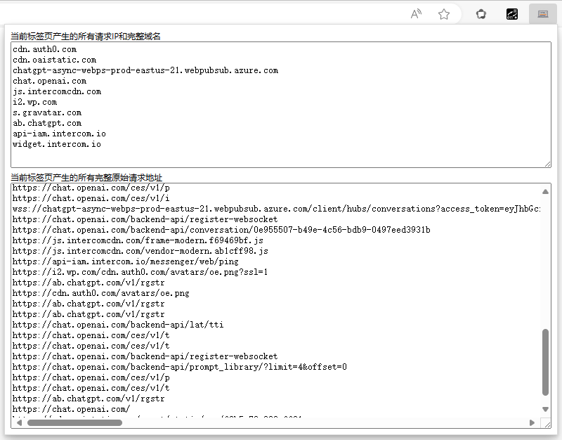
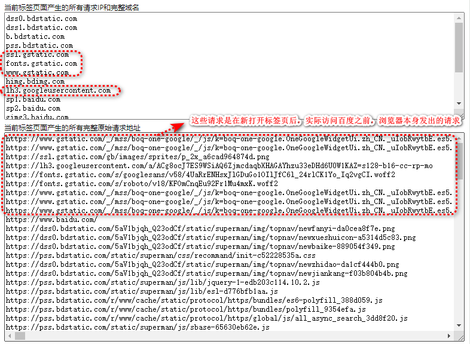

# request-record 插件
当点击插件图标时，显示的是点击那一刻该标签页面之前的所有请求，如果页面此时仍然有请求，需要再次点击插件图标来查看  
  

**注意事项：**  
当新打开一个空白标签页面，Chrome浏览器本身可能也会在该页面发送请求（登录Google账号的情况下），或者在地址栏输入网址时，浏览器会进行某些预加载，这些请求也会被算作该标签页面的请求记录，这是Chrome浏览器的机制，不是插件的问题  

以Chrome浏览器访问百度首页为例，最初的一部分请求是发送到Google的，然而却也被算作该标签页产生的请求，如图：  
  

解决Chrome浏览器该机制的几种参考方法：
- 使用Edge浏览器，虽然Edge在新的空白标签页或预加载也可能会产生请求，但并不算在该标签页的请求记录中
- 使用Chrome浏览器时，通过其他页面或其他地方打开要分析的网页链接
- 使用Chrome浏览器时，复制网址，打开新空白标签页，然后非常迅速地粘贴回车打开页面
