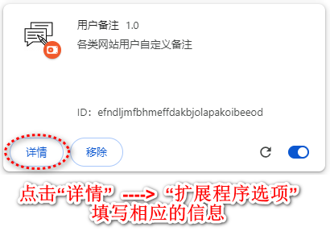
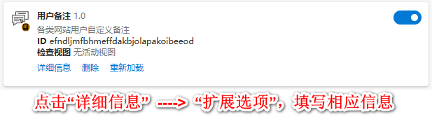
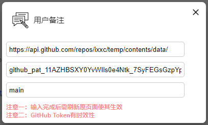
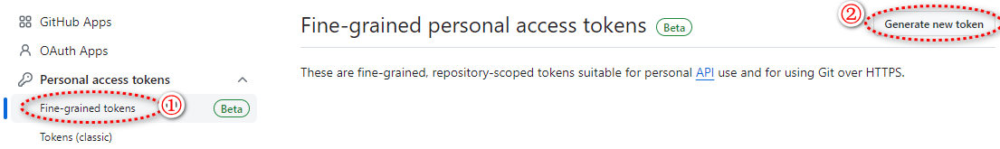
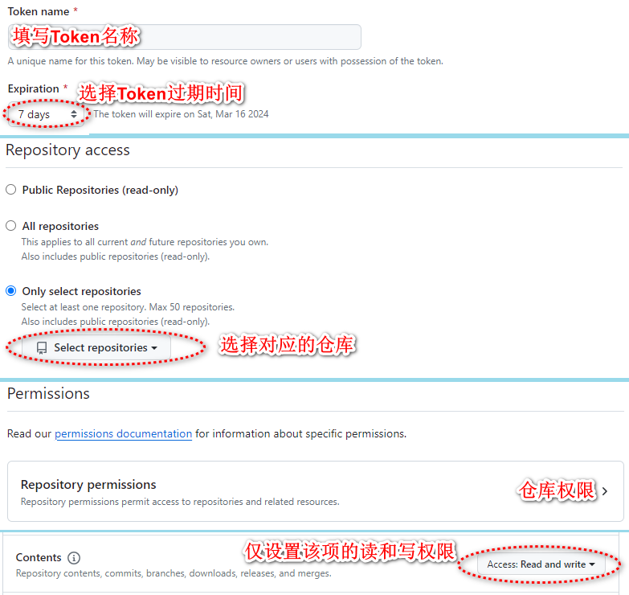

## user-remark 插件
**如果需要把数据上传到GitHub，才需要做如下操作，否则可以忽略以下流程，直接使用插件**

Chrome浏览器插件设置：  
  
Edge浏览器插件设置：  

示例参考：  
  
参数解释：  
https://api.github.com/repos/你的用户名/你的仓库名称/contents/路径/  
https://api.github.com/repos/ixxc/temp/contents/ ：表示数据放到temp仓库的根目录下  
https://api.github.com/repos/ixxc/temp/contents/data/ ：表示数据放到temp仓库的data目录下

### github token 获取
1、打开： https://github.com/settings/tokens?type=beta  

2、配置Token，将得到的Token填入浏览器插件的对应的输入框中  
  
